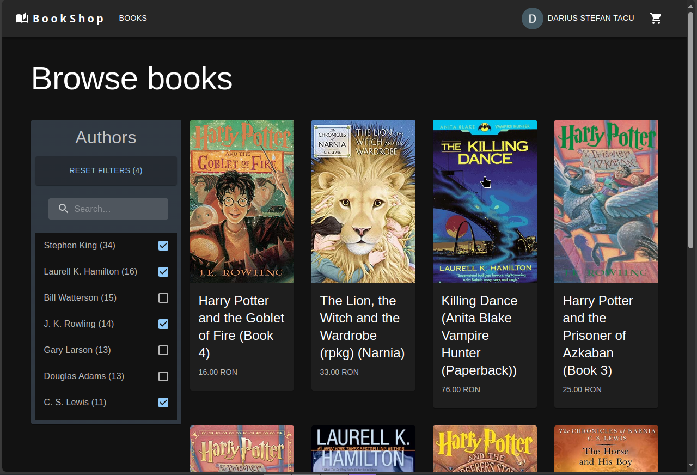
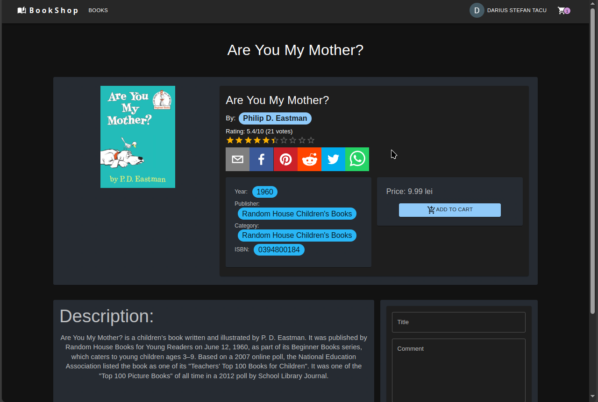
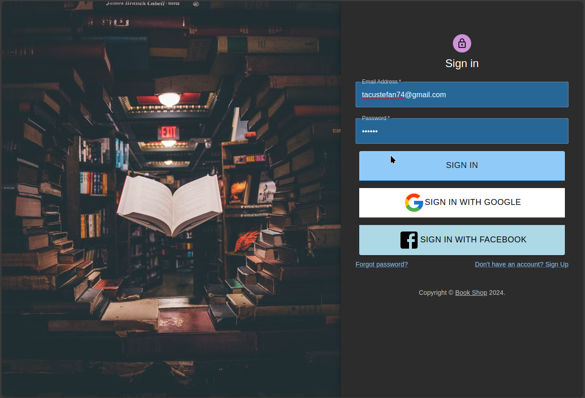

# BookHub

## Description

BookHub is an e-commerce application where users can browse, search, and purchase books. The application leverages a variety of modern web technologies and uses data sourced from the [Book-Crossing dataset](https://www.kaggle.com/datasets/ruchi798/bookcrossing-dataset).

## Table of Contents

- [Features](#features)
- [Technologies](#technologies)
- [Libraries](#libraries)

## Features

- User authentication
- Browse books
- Add books to cart and purchase
- Responsive design
- Data persistence with Firestore
- Filters For Books
- Commnets \ Reviews

## Technologies

- React (with Vite and Material-UI)
- Firebase (Authentication and Firestore Database)

## Libraries

- Formik
- Yup
- Axios
- LocalForage
- Fuzzysort